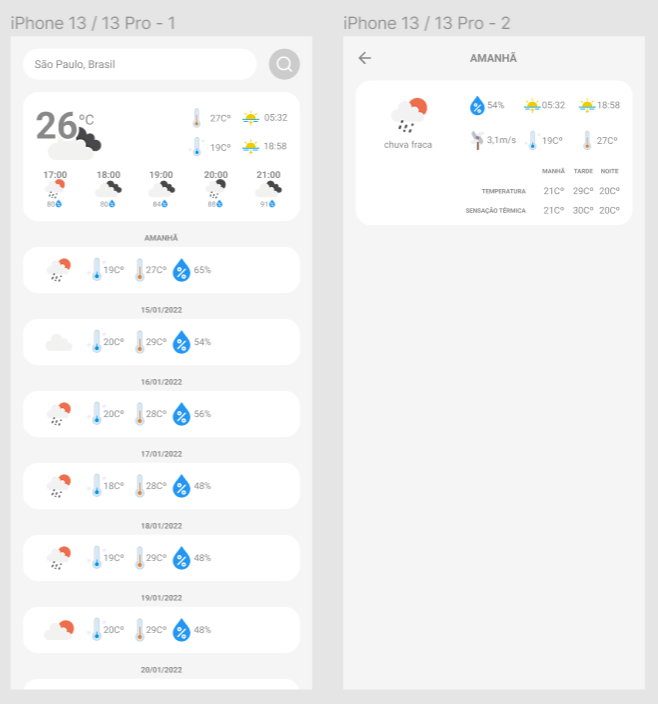

# Desafio front end mobile

O desafio tem como objetivo avaliar seus conhecimentos e experiência em:
* Elaboração de layouts
* Capacidade de entender e resolver tarefas
* Qualidade de código
* Organização de projeto
* Domínio de versionamento de código

Caso não consiga atender a todos os requisitos, não deixe de entregar a tarefa! Entendemos que conhecimento técnico se adquire com tempo e experiência. E tenha em mente que a avaliação será minuciosa.

## Desafio
Criar um app de previsão do tempo, utilizando React Native (obrigatório). Ao final da tarefa, o aplicativo deverá se parecer com a imagem abaixo:

## Observações
Material de apoio para resolução da tarefa:
* A API que deve ser utilizada encontra-se neste link: https://openweathermap.org
* Lista de ícones disponíveis para previsão do tempo: https://openweathermap.org/weather-conditions
* Link do projeto no Figma: https://www.figma.com/file/2rtXSBjoY1qupyLexGcqkz/%5BLIT%5D-Desafio-Front-End?node-id=0%3A1

É desejável o uso das seguintes tecnologias:
* Redux, Redux Saga e Redux Toolkit
* Styled Components
* TypeScript
* React Navigation

## Entrega
Crie um repositório público no GitHub, e envie o link para o e-mail: `ti@it-lit.com`. Se possível, inclua uma build do projeto no repositório, para evitar que haja alguma falha de build durante a nossa avaliação.